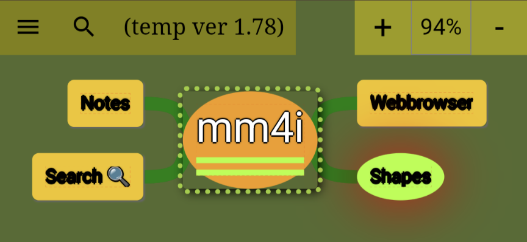

# Mindmaps 4 Internet

Mindmaps in your web browser. So you can use it in your mobile phone. Or in your desktop computer.

MM4I (Mindmaps 4 Internet) offers that.
        No installation required. Since it is a web page.
        You can start it [here](https://lborgman.github.io/mm4i/mm4i.html):

        <figure>
            
            <figcaption>Start mm4i</figcaption>
        </figure>

The mindmaps you create are stored locally in your web browser on your computer or mobile.  (But you still have to be connected to the Internet since MM4I is loaded from the its sources every time you start it.  I will change that soon so you can use MM4I when you are offline.)

## Usage
Just try it. If you think something needs to be explained then please tell me [here](https://github.com/lborgman/mm4i/issues).

Hm. Maybe node notes and search needs explanation?

### Node notes and search links
Each node in a mindmap can have a note that you create.  You can search the mindmap for the text in the node notes.  And you can create "search links" in your node notes that start such a search when clicked.

(To create a "search link" just click the orange search icon in the toolbar when you are editing a node note.)

## Background
Ever since I first saw mindmaps in practical use I have wanted to use it myself.  But. It looked like you needed a big paper.  Or rather several to redraw the mindmap. 

Putting the mindmap in a computer could be a good idea, I thought.  And then, preferably the computer I always bring with me, my mobile.

Yes, I know. There are some apps for Android that can do this. But I never install apps from unknown developers because of potential security problems. There are less such problem with an approach like this since this web app is basically a web page.

## Acknowledgement

First of all I would not have written **MM4I** (Mindmaps for Internet) if [Zhigang Zhang](https://github.com/hizzgdev) had not written **jsmind**. 

I was looking for mindmap software that ran in the web browser.  The only mindmap software I found was jsmind.  It ran quite nicely in a web browser on a desktop PC using a mouse.  However it did not work in my mobile (Android, of course).

So I thought I should just fix that... 

It was far more work than I expected.  But also difficult sometimes, which made it more fun.

I strived a bit to make it easy to move nodes in a mindmap.  Zhigang came up with a nice idea which I decided to use.

Using a touch screen instead of a mouse is a challenge.  **jssm** helped a lot when I struggled to implement that.

I did add some things to try to give MM4I the "feel" of a mindmap.  Colors, shape etc.  And notes for nodes - which I think is a natural addition for a computer based mindmap.

* [jsmind](https://www.npmjs.com/package/jsmind)
* [jssm](https://www.npmjs.com/package/jssm)
    * [jssm-viz](https://www.npmjs.com/package/jssm-viz)
    * [viz-js](https://www.npmjs.com/package/@viz-js/viz)
* [TOAST UI Editor](https://github.com/nhn/tui.editor/blob/master/README.md)
* [Visual Studio Code](https://code.visualstudio.com/)
* [GitHub](https://github.com/)
* [Google Chrome](https://en.wikipedia.org/wiki/Google_Chrome)

##### My dev notes
* [mobile display bug example](https://lborgman.github.io/mm4i/mobile-disp-bug.html)
* [mobile display bug issue](https://issues.chromium.org/issues/381679574)
* [mobile display bug workaround](https://lborgman.github.io/mm4i/mobile-disp-bug-workaround.html)
